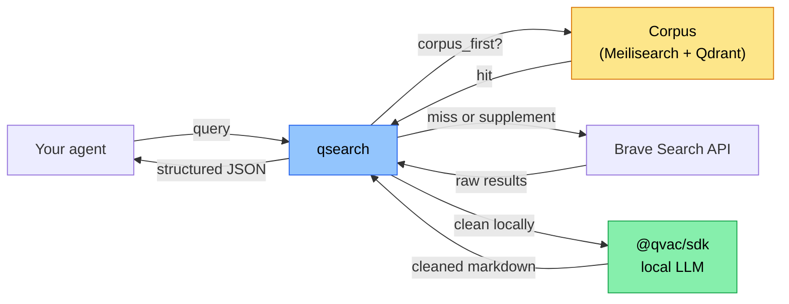

# qsearch

> *"[Planning to build a search API with QVAC SDK.](https://x.com/TheTieTieTies/status/2044039772981576181)"*


This repo is the follow-through. **A search API built on the QVAC SDK**, where Brave results get cleaned by your own local QVAC LLM — never a cloud server — so agents running on Tether's edge stack can read the live web without breaking the *"data never leaves your hardware"* principle.

We call it **the open-web hop for QVAC agents**.

> ✅ **v0.3.0 live at [qsearch.pro](https://qsearch.pro).** Now with a persistent corpus: crawl and index your own URLs, then search them first before hitting Brave. Full MCP support for QVAC Workbench.
> Daily log: [@TheTieTieTies](https://x.com/TheTieTieTies) · Architecture: [docs/ARCHITECTURE_V03.md](./docs/ARCHITECTURE_V03.md)

## Quick start

```bash
# 1. Clone
git clone https://github.com/theYahia/qsearch.git
cd qsearch

# 2. Get a Brave Search API key ($5/month, ~1000 queries)
#    → https://brave.com/search/api/ → sign up → copy key

# 3. Create .env.local and paste your key
cp .env.example .env.local
# Open .env.local and set BRAVE_API_KEY=your_actual_key

# 4. Start infrastructure (Meilisearch + Qdrant)
docker compose up -d

# 5. Install & run
npm install
npm start      # → qsearch v0.3.0 listening on http://localhost:8080

# 6. (Optional) MCP server for QVAC Workbench
npm run start:mcp  # → http://0.0.0.0:8081

# 7. Test
curl http://localhost:8080/health
curl -X POST http://localhost:8080/search \
  -H "Content-Type: application/json" \
  -d '{"query": "qvac sdk", "n_results": 2}'
```

**Brave API key is BYOK** — it stays in your `.env.local`, never leaves your machine.

---

## Why qsearch exists

Tether's edge-first open-source stack:

- **QVAC SDK** (2026-04-09) — local LLM inference on phones, laptops, Raspberry Pi
- **WDK** (2026-04-13) — self-custodial wallet toolkit
- **QVAC Workbench** — local-document Q&A desktop app

What's missing is the **open-web hop**. An agent running on QVAC can answer from its own files, but the moment it needs to read the live web, it either (a) calls Exa/Tavily/Sonar — which means sending the query and seeing the cleaned result *through a cloud server* — or (b) parses raw HTML by hand.

qsearch closes that gap: live web search with local LLM cleaning, plus a persistent corpus of URLs you've indexed yourself.

## How it works



The green node runs on your device. The yellow node is your private corpus. Brave is only called when the corpus doesn't have enough results.

## How qsearch compares

|  | Exa | Tavily | Sonar | Brave API | SearXNG | **qsearch** |
|---|---|---|---|---|---|---|
| OSS core | ❌ | ❌ | ❌ | ❌ | ✅ | ✅ |
| LLM cleaning | ✅ (cloud) | ✅ (cloud) | ✅ (cloud) | ❌ | ❌ | ✅ (**local**) |
| Private corpus | ❌ | ❌ | ❌ | ❌ | ❌ | ✅ |
| Agent-first JSON | ≈ | ≈ | ≈ | ❌ | ❌ | ✅ |
| Self-hostable | ❌ | ❌ | ❌ | ❌ | ✅ | ✅ |
| QVAC-native | ❌ | ❌ | ❌ | ❌ | ❌ | ✅ |
| BYOK upstream | ❌ | ❌ | ❌ | N/A | ✅ | ✅ |

## API — v0.3.0

### Search endpoints

| Endpoint | What | Brave source |
|----------|------|-------------|
| `POST /search` | Web search + QVAC cleaning | `/web/search` |
| `POST /news` | News search + cleaning | `/news/search` |
| `POST /context` | Deep page extraction + cleaning | `/llm/context` |

All search endpoints accept:

| Parameter | Type | Default | Description |
|-----------|------|---------|-------------|
| `query` | string | required | Search query |
| `n_results` | number | 3 | Results count |
| `freshness` | string | — | `pd` / `pw` / `pm` / `py` or `YYYY-MM-DDtoYYYY-MM-DD` |
| `search_lang` | string | — | Language: `"en"`, `"ru"`, etc. |
| `country` | string | — | Country: `"us"`, `"ru"`, etc. |
| `corpus_first` | boolean | `true` | Search corpus before Brave |
| `corpus_only` | boolean | false | Skip Brave entirely |

Response includes `source: "corpus" | "brave" | "hybrid"` and `corpus_ms: number | null`.

### Corpus endpoints

| Endpoint | What |
|----------|------|
| `POST /index` | Crawl a URL and index into corpus; returns `job_id` (HTTP 202) |
| `GET /index/:job_id` | Job status: `queued / running / done / failed` + pages crawled/indexed |
| `GET /corpus/stats` | `total_documents`, `meilisearch_size_mb`, `qdrant_vectors` |
| `GET /health` | Server status including corpus availability |

```bash
# Index a URL
curl -X POST http://localhost:8080/index \
  -H "Content-Type: application/json" \
  -d '{"url": "https://docs.holepunch.to/", "depth": 2}'

# Check progress
curl http://localhost:8080/index/<job_id>

# Stats
curl http://localhost:8080/corpus/stats
```

### Example search response

```bash
curl -X POST http://localhost:8080/search \
  -H "Content-Type: application/json" \
  -d '{"query": "qvac sdk", "n_results": 2, "corpus_first": true}'
```

```json
{
  "query": "qvac sdk",
  "source": "hybrid",
  "corpus_ms": 9,
  "brave_ms": 819,
  "results": [
    {
      "url": "https://qvac.tether.io/",
      "title": "QVAC - Decentralized, Local AI",
      "cleaned_markdown": "QVAC is a decentralized, local AI platform...",
      "clean_ms": 1420
    }
  ]
}
```

### MCP (QVAC Workbench)

```bash
npm run start:mcp
# → http://0.0.0.0:8081  (also live at qsearch.pro/mcp)
```

## Stack

| Component | Tech |
|-----------|------|
| Runtime | Node.js ≥20 |
| Search backend | Brave Search API (BYOK) |
| LLM cleaning | `@qvac/sdk` with Qwen3-0.6B Q4 (~364MB, cached) |
| Full-text corpus | Meilisearch v1.7 |
| Vector corpus | Qdrant v1.17.1 |
| Crawler | crawl4ai 0.8.6 (Python, subprocess) |
| MCP | `@modelcontextprotocol/sdk` |
| License | Apache-2.0 |

## Honest trade-offs

- **Cold start.** Loading a local LLM takes seconds. qsearch is best run as a long-lived daemon.
- **Qdrant vectors offline.** Vector search requires `@qvac/sdk` embedding — unavailable on Windows without bare-runtime. Full-text search via Meilisearch works everywhere.
- **Single web provider.** Brave only for live search. SearXNG fallback is wired but optional (`docker compose --profile full up`).
- **Self-host first.** [qsearch.pro](https://qsearch.pro) is a public demo. The design assumes you run your own instance.

## Follow the build

- 🌐 **Live demo:** [qsearch.pro](https://qsearch.pro)
- ⭐ **Star this repo**
- 🐦 **X thread:** [@TheTieTieTies](https://x.com/TheTieTieTies)

## License

Apache-2.0 — same as QVAC itself. See [LICENSE](./LICENSE).
