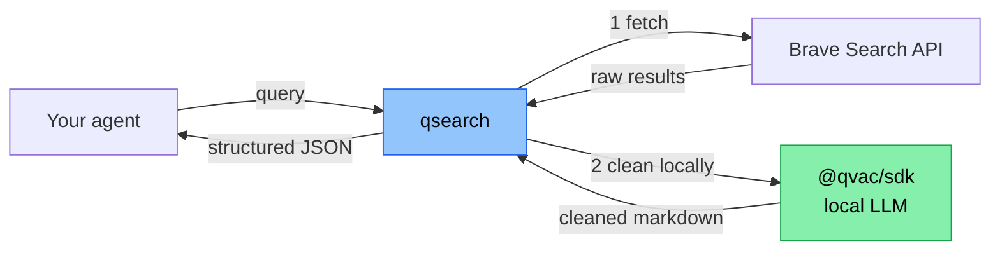

# qsearch

> *"[Planning to build a search API with QVAC SDK.](https://x.com/TheTieTieTies/status/2044039772981576181)"*


This repo is the follow-through. **A search API built on the QVAC SDK**, where Brave results get cleaned by your own local QVAC LLM — never a cloud server — so agents running on Tether's edge stack can read the live web without breaking the *"data never leaves your hardware"* principle.

We call it **the open-web hop for QVAC agents**.

> 🚧 **Day 1 of a 7-day public build.** This README is the thesis; code ships this week.
> Daily log: [@TheTieTieTies](https://x.com/TheTieTieTies) · Roadmap: [ROADMAP.md](./ROADMAP.md)

---

## Why qsearch exists

Tether just shipped an edge-first open-source stack:

- **QVAC SDK** (2026-04-09) — local LLM inference on phones, laptops, Raspberry Pi
- **WDK** (2026-04-13) — self-custodial wallet toolkit
- **QVAC Workbench** — local-document Q&A desktop app

What's missing is the **open-web hop**. An agent running on QVAC can answer from its own files, but the moment it needs to read the live web, it either (a) calls Exa/Tavily/Sonar — which means sending the query and seeing the cleaned result *through a cloud server* — or (b) parses raw HTML by hand.

qsearch is the primitive that closes that gap on the user's own hardware.

## How it works



The green node is the whole story. The LLM cleaning step — the part that reads the page, extracts the answer, decides what matters — **runs on the user's device, not on our server**. It's architectural, not a privacy-policy promise. You can verify it by reading the code.

## Why Brave specifically

Not because it's trendy. Because it's the only search backend where the whole architecture *holds*:

- **Independent index.** Brave crawls its own web — not a Google or Bing wrapper. qsearch is a real alternative to the big-cloud APIs, not a thin reskin.
- **Data-for-AI tier, BYOK.** Brave's commercial tier explicitly supports AI transformation of results, removing the ToS grey zone that blocks agent apps on other providers.
- **No query profiling upstream.** Brave's business model doesn't depend on tracking queries. The data-hygiene story is consistent end-to-end: Brave doesn't track, qsearch doesn't clean in the cloud, the agent stays local.
- **Not owned by a cloud giant.** Using Google/Bing to power a *Tether-aligned, edge-first* primitive would be architecturally incoherent. Brave is independent — that matches the ethos of the stack we're building on.
- **Stable API, good docs.** Practical bonus: every hour spent fighting the provider is an hour not spent on the cleaning layer, which is where the actual differentiation lives.

We're not locked to Brave forever — v2 may add SearXNG or Mullvad Leta as drop-in providers. But for the MVP, **one backend that fits the thesis end-to-end > three backends that fight it**.

## How qsearch compares

|  | Exa | Tavily | Sonar | Brave API | SearXNG | **qsearch** |
|---|---|---|---|---|---|---|
| OSS core | ❌ | ❌ | ❌ | ❌ | ✅ | ✅ |
| LLM cleaning | ✅ (cloud) | ✅ (cloud) | ✅ (cloud) | ❌ | ❌ | ✅ (**local**) |
| Agent-first JSON | ≈ | ≈ | ≈ | ❌ | ❌ | ✅ |
| Self-hostable | ❌ | ❌ | ❌ | ❌ | ✅ | ✅ |
| QVAC-native | ❌ | ❌ | ❌ | ❌ | ❌ | ✅ |
| BYOK upstream | ❌ | ❌ | ❌ | N/A | ✅ | ✅ |

qsearch is the first row where *all* of these are checked. That's the wedge — not better snippets, not faster ranking. **Local cleaning on OSS, as a primitive for agents.** The intersection didn't exist until now.

## MVP API (target shape for v0.1)

> ⚠️ **Status:** shipping 2026-04-17. The example below is the target shape, not a live endpoint yet. Current repo state: skeleton + thesis.

```bash
curl -X POST http://localhost:8080/search \
  -H "Content-Type: application/json" \
  -d '{"query": "latest QVAC SDK release notes", "n_results": 5}'
```

```json
{
  "results": [
    {
      "url": "https://...",
      "title": "...",
      "cleaned_markdown": "QVAC SDK 0.9.0 shipped on 2026-04-09...",
      "source_score": 0.87
    }
  ]
}
```

**Stack:**
- **Runtime:** Node.js via Bare (required by `@qvac/sdk`)
- **Backend:** Brave Search API, BYOK (`BRAVE_API_KEY` env var)
- **LLM:** `@qvac/sdk` with a small quantized model (Llama 3.2 1B or Qwen 0.5B)
- **License:** Apache-2.0

## Honest trade-offs

- **Cold start.** Loading a local LLM takes seconds. qsearch is best run as a long-lived local daemon, not a cold-fired lambda.
- **Single provider in v1.** Brave only. More providers are v2.
- **Self-host only.** No hosted tier. If you want zero-ops, Exa and Tavily exist and are good.
- **The wedge is architecture, not ranking.** qsearch won't out-rank Exa on snippet quality. It wins when *you* care that cleaning runs on your hardware, not theirs.

## Follow the build

A new commit, demo, or writeup ships every day until **2026-04-21**.

- ⭐ **Star this repo** to get notified when v0.1 lands (target: 2026-04-17)
- 🐦 **X thread:** [@TheTieTieTies](https://x.com/TheTieTieTies) — daily updates
- 🗺️ **Full 7-day plan:** [ROADMAP.md](./ROADMAP.md)
- 📝 **Feature requests for v2:** open an issue

## License

Apache-2.0 — same as QVAC itself. See [LICENSE](./LICENSE).
