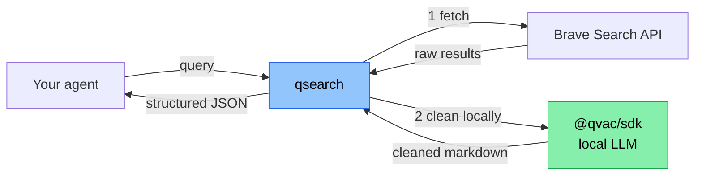

# qsearch

> *"[Planning to build a search API with QVAC SDK.](https://x.com/TheTieTieTies/status/2044039772981576181)"*


This repo is the follow-through. **A search API built on the QVAC SDK**, where Brave results get cleaned by your own local QVAC LLM — never a cloud server — so agents running on Tether's edge stack can read the live web without breaking the *"data never leaves your hardware"* principle.

We call it **the open-web hop for QVAC agents**.

> ✅ **v0.2.1 live (2026-04-16).** 4 endpoints: `/search`, `/news`, `/context`, `/health` + MCP tool.
> Daily log: [@TheTieTieTies](https://x.com/TheTieTieTies) · Roadmap: [ROADMAP.md](./ROADMAP.md) · PRD: [docs/PRD.md](./docs/PRD.md)

## Quick start

```bash
# 1. Clone
git clone https://github.com/theYahia/qsearch.git
cd qsearch

# 2. Get a Brave Search API key (free $5/month credit)
#    → https://brave.com/search/api/ → sign up → copy key

# 3. Create .env.local with your key
cp .env.example .env.local
# Edit .env.local and replace "your_brave_data_for_ai_key_here" with your real key

# 4. Install & run
npm install    # first run downloads Qwen3-0.6B (~364MB, cached after)
npm start      # → qsearch v0.2.1 listening on http://localhost:8080

# 5. Test
curl -X POST http://localhost:8080/search \
  -H "Content-Type: application/json" \
  -d '{"query": "qvac sdk", "n_results": 2}'
```

**Brave API key is BYOK** — you get your own key, it stays in your `.env.local`, never leaves your machine. qsearch doesn't proxy, relay, or store your key.

---

## Why qsearch exists

Tether's edge-first open-source stack came together over the past week:

- **QVAC SDK** (2026-04-09) — local LLM inference on phones, laptops, Raspberry Pi
- **WDK** (2026-04-13) — self-custodial wallet toolkit
- **QVAC Workbench** — local-document Q&A desktop app

What's missing is the **open-web hop**. An agent running on QVAC can answer from its own files, but the moment it needs to read the live web, it either (a) calls Exa/Tavily/Sonar — which means sending the query and seeing the cleaned result *through a cloud server* — or (b) parses raw HTML by hand.

qsearch is the primitive that closes that gap on the user's own hardware.

## How it works



The green node is the whole story. The LLM cleaning step — the part that reads the page, extracts the answer, decides what matters — **runs on the user's device, not on our server**. It's architectural, not a privacy-policy promise. You can verify it by reading the code.

## Why Brave specifically

Not because it's trendy. Because it's the only search backend where the whole architecture *holds*:

- **Independent index.** Brave crawls its own web — not a Google or Bing wrapper. qsearch is a real alternative to the big-cloud APIs, not a thin reskin.
- **Data-for-AI tier, BYOK.** Brave's commercial tier explicitly supports AI transformation of results, removing the ToS grey zone that blocks agent apps on other providers.
- **No query profiling upstream.** Brave's business model doesn't depend on tracking queries. The data-hygiene story is consistent end-to-end: Brave doesn't track, qsearch doesn't clean in the cloud, the agent stays local.
- **Not owned by a cloud giant.** Using Google/Bing to power a *Tether-aligned, edge-first* primitive would be architecturally incoherent. Brave is independent — that matches the ethos of the stack we're building on.
- **Stable API, good docs.** Less time fighting the backend, more time on the cleaning layer — which is where the differentiation lives.

We're not locked to Brave forever — v2 may add SearXNG or Mullvad Leta as drop-in providers. But for the MVP, **one backend that fits the thesis end-to-end > three backends that fight it**.

## How qsearch compares

|  | Exa | Tavily | Sonar | Brave API | SearXNG | **qsearch** |
|---|---|---|---|---|---|---|
| OSS core | ❌ | ❌ | ❌ | ❌ | ✅ | ✅ |
| LLM cleaning | ✅ (cloud) | ✅ (cloud) | ✅ (cloud) | ❌ | ❌ | ✅ (**local**) |
| Agent-first JSON | ≈ | ≈ | ≈ | ❌ | ❌ | ✅ |
| Self-hostable | ❌ | ❌ | ❌ | ❌ | ✅ | ✅ |
| QVAC-native | ❌ | ❌ | ❌ | ❌ | ❌ | ✅ |
| BYOK upstream | ❌ | ❌ | ❌ | N/A | ✅ | ✅ |

qsearch is the first row where *all* of these are checked. That's the wedge — not better snippets, not faster ranking. **Local cleaning on OSS, as a primitive for agents.** The intersection didn't exist until now.

## API — v0.2.1 (live)

### Endpoints

| Endpoint | What | Brave source |
|----------|------|-------------|
| `POST /search` | Web search + QVAC cleaning | `/web/search` (1-20 results) |
| `POST /news` | News search + cleaning | `/news/search` (1-50 results) |
| `POST /context` | Deep page extraction + cleaning | `/llm/context` (2-28 snippets/source) |
| `GET /health` | Server status | — |

### Optional parameters (all endpoints)

| Parameter | Type | Description |
|-----------|------|-------------|
| `query` | string | Search query (required) |
| `n_results` | number | Results count (default: 3) |
| `freshness` | string | `pd` (day), `pw` (week), `pm` (month), `py` (year), or `YYYY-MM-DDtoYYYY-MM-DD` |
| `search_lang` | string | Language: `"en"`, `"ru"`, etc. |
| `country` | string | Country: `"us"`, `"ru"`, etc. |

### Example

```bash
curl -X POST http://localhost:8080/search \
  -H "Content-Type: application/json" \
  -d '{"query": "qvac sdk", "n_results": 2}'
```

```json
{
  "query": "qvac sdk",
  "model": "QWEN3_600M_INST_Q4",
  "brave_ms": 819,
  "results": [
    {
      "url": "https://qvac.tether.io/",
      "title": "QVAC - Decentralized, Local AI in a Single API",
      "description": "QVAC is Tether's answer to centralized AI...",
      "cleaned_markdown": "QVAC is a decentralized, local AI platform built on Tether, offering a new paradigm where intelligence runs privately, locally, and without permission on any device.",
      "clean_ms": 1420
    },
    {
      "url": "https://tether.io/news/tether-launches-qvac-sdk...",
      "title": "Tether Launches QVAC SDK...",
      "description": "QVAC SDK is a unified software development kit...",
      "cleaned_markdown": "Tether.io launched the QVAC SDK, a unified AI development kit enabling AI training and evolution across any device and platform.",
      "clean_ms": 1008
    }
  ]
}
```

`brave_ms` = Brave fetch latency. `clean_ms` = local LLM inference per result. The green node in the diagram above — that's where `clean_ms` happens, on your machine.

**Stack:**
- **Runtime:** Node.js ≥20 (`@qvac/sdk` bundles bare worker — no system install needed)
- **Backend:** Brave Search API, BYOK (`BRAVE_API_KEY` in `.env.local`)
- **LLM:** `@qvac/sdk` with Qwen3-0.6B Q4 (~364MB, downloads once, cached locally)
- **License:** Apache-2.0

## Honest trade-offs

- **Cold start.** Loading a local LLM takes seconds. qsearch is best run as a long-lived local daemon, not a cold-fired lambda.
- **Single provider in v1.** Brave only. More providers are v2.
- **Self-host only.** No hosted tier. If you want zero-ops, Exa and Tavily exist and are good.
- **The wedge is architecture, not ranking.** qsearch won't out-rank Exa on snippet quality. It wins when *you* care that cleaning runs on your hardware, not theirs.

## Follow the build

A new commit, demo, or writeup ships every day until **2026-04-21**.

- ⭐ **Star this repo** — v0.2.1 live with 4 endpoints + MCP tool
- 🐦 **X thread:** [@TheTieTieTies](https://x.com/TheTieTieTies) — daily updates
- 🗺️ **Full 7-day plan:** [ROADMAP.md](./ROADMAP.md)
- 📝 **Feature requests for v2:** open an issue

## License

Apache-2.0 — same as QVAC itself. See [LICENSE](./LICENSE).
